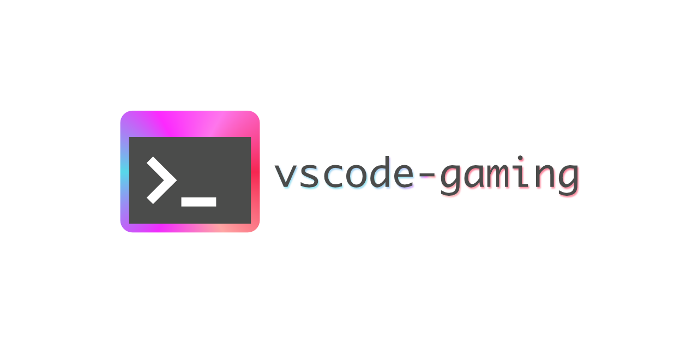

# vscode-gaming

[](https://marketplace.visualstudio.com/items?itemName=omi.vscode-gaming)
[](https://github.com/akiomik/vscode-gaming/actions/workflows/test.yml)



A gaming theme for [Visual Studio Code](https://azure.microsoft.com/en-us/products/visual-studio-code).
Port of [gaming.vim](https://github.com/high-moctane/gaming.vim).

## Features

https://github.com/akiomik/vscode-gaming/assets/1457682/1a4424d9-5c9c-4eac-9f5d-1028a4e443d0

## Commands

* `Start gaming mode`: Start gradient animation
* `Stop gaming mode`: Stop gradient animation

## Extension Settings

This extension contributes the following settings:

* `gaming.period`: The gradient color cycle in milliseconds (defaults: `10000`)
* `gaming.updateTime`: The updating interval in milliseconds (defaults: `50`)
* `gaming.target`: The colorization target in `workbench.colorCustomizations` namespace (defaults: `"editor.background"`)

## Release Notes

### 0.0.1

Initial release

## Development

1. Open this project with Visual Studio Code:

```bash
code .
```

2. Press `F5` to open a new window with this extension loaded.
3. Run the command from the command palette by pressing (`Ctrl+Shift+P` or `Cmd+Shift+P` on Mac) and typing `gaming mode`.

## Testing

```bash
npm test
```
